# ROCK, PAPER, SCISSORS, LIZARD, SPOCK

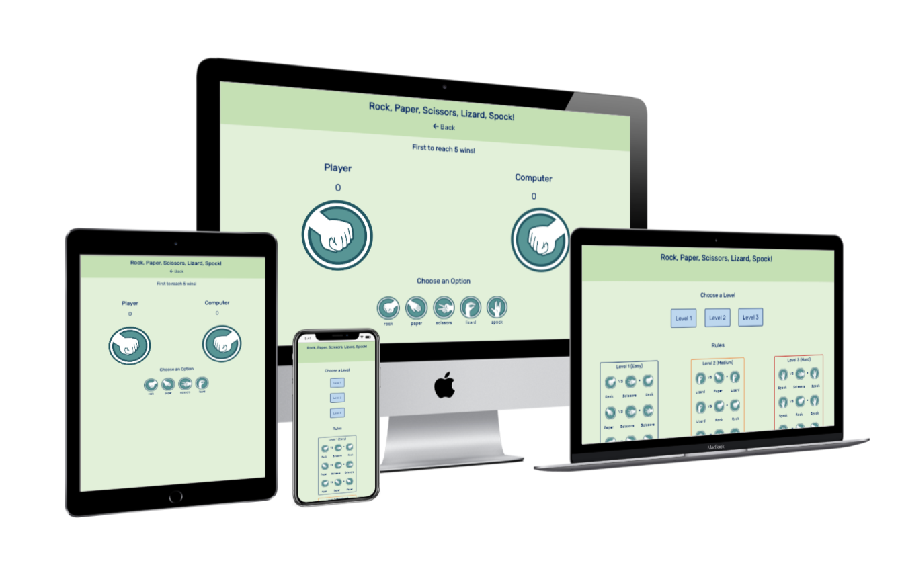

This is a Rock, Paper Scissors game but with a twist! This game lets the user increase the level of difficulty. The game is responsive to different devices and can be played on a laptop, mobile phone and tablet.

## How to Play

Upon loading the website, the homepage will show. Simply select which level you wish to play (Level 1 - easy, Level 2 - medium, Level 3 - hard). The game page will load and you can start by selecting which option (Rock, Paper, Scissors, Lizard, Spock) to play against the computer. Good Luck!
___
## Rules

The rules are displayed on the homepage and are also shown below:

**Level 1**

Rock beats Scissors

Scissors beats Paper

Paper beats Rock

**Level 2**

Lizard beats Paper

Scissors beats Lizard

Rock beats Lizard

**Level 3**

Spock beats Scissors

Spock beats Rock

Lizard beats Spock

Paper beats Spock
___

## User Experience

**Target Audience**

The target audience for this game are both experienced and inexperienced gamers. The experienced gamers may wish to play a more difficult version of rock, paper, scissors. Whereas the inexperienced gamers may wish to play the easiest version with the rules provided.

## User Stories

1. As a gamer, I want to play a rock, paper, scissors game that is easy to understand. End user goal: Play a rock, paper, scissors game. End business goal: Keep users playing game and spreading word of mouth about game. Acceptance criteria: Create rock, paper, scissors game using HTML and CSS for website and JavaScript for input commands.

2. As an experienced gamer, I want the ability to increase the level of difficulty of the game. End user goal: Play more levels of the game. End business goal: Keep users playing the game and not getting bored. Acceptance criteria: Add more options for user to choose (Level 2 - Add Lizard, Level 3 - Add Spock).

3. As a novice to the game, rock paper scissor, I want to be shown how to play. End user goal: Learn how to play rock paper scissors. End business goal: Have users learn how to play so they will keep playing the game. Acceptance criteria: Add a rules section explaining what choice wins over the other (e.g Rock wins over Scissors).

4. As a novice to computers, I want to easily find my way around the website. End user goal: Easily navigate through the website. End business goal: Keep users using the website and not leaving due to getting lost. Acceptance crtiteria: Create navigation bar for the different pages used (index and game page).
___
## Wireframes

I used Microsoft Word to build the wireframes after a rough sketch on a notepad.

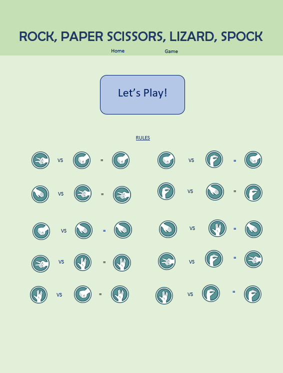

Initially, the index page looked like this. Once I started building the game on html and adding style, I noticed that the rules section was not clear. So I added text labelling what each image was.

I also noticed that the wireframe did not meet the criteria for user #2 (The Experienced Gamer) by not adding the ability to select the different levels. I then rearranged the rules into three different sections and made it clear that these were different levels.

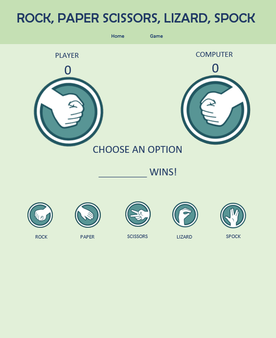

The final game page is close to the wireframe except for the navigation bar. I decided to replace the two links with one that returns the user to the index page.

## Features

**Homepage**

*Level Select*

The homepage has a level select where the user may choose what level to play.

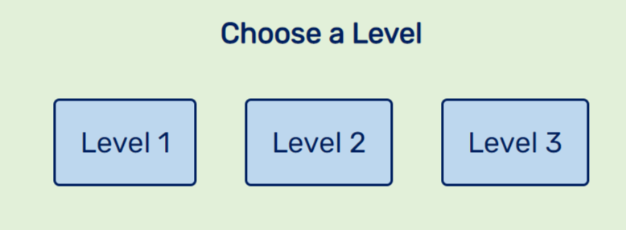

*Rules*

Here are the rules for each level, explaining what hand wins over the other.

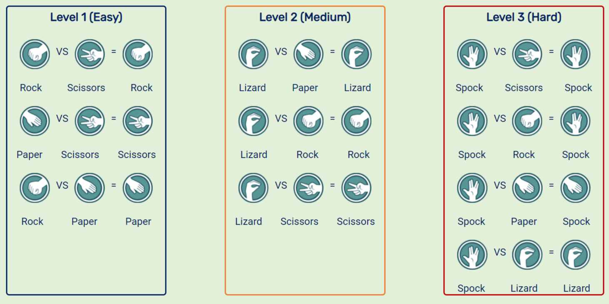

**Game Page**

*Score*

Here is a score count for each player so the user can keep track of who is winning.

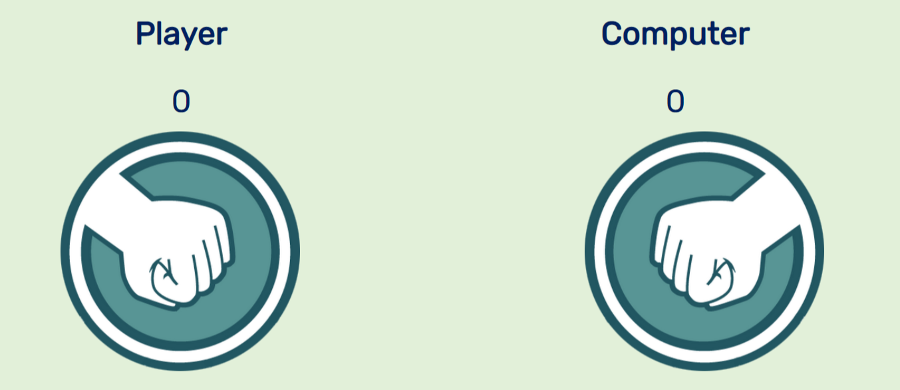

*Max score*

If the player's score reaches 5, the page will display an alert that tells the player they won.

If the computer's score reaches 5, the page will display and alert that tells the player they lost but invite to try again.

After clicking off the alert, the score will be reset.

*Options*

Here are the options that the user clicks to choose their hand. Depending on the level select, there is a limit to what options will show (e.g. 'easy' will only show 'rock', 'paper', and 'scissors')

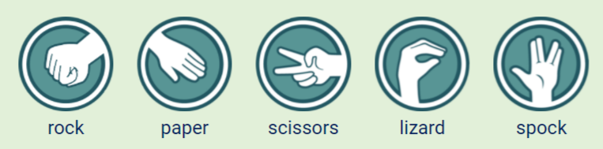
___

## Future Development

*Hand-shake animation*

I would like to add an animation to the game that makes both the hands shake up and down after the player selects an option for a few seconds before the hands update.

*High-score*

Initially, one of the user stories was to implement a high-score feature that records the player's high score. I decided to not implement this feature because there is already a player score that resets after 5 tries. By adding more scores I feel the user may get confused.

___
## Testing

The html and css code have been tested and validated via [W3C](https://validator.w3.org/) and returned with no errors.

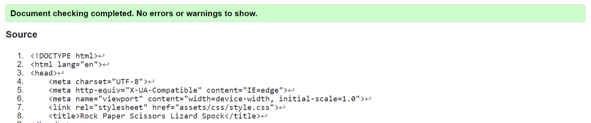

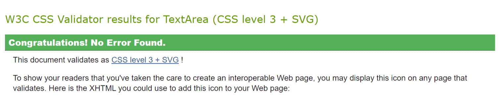

Found no errors when running JavaScript code through [Jshint](https://jshint.com/). Found some minor warnings alerting that some functions may not be available in all browser versions.

While using chromes developer tools, I encountered an error log in the console alerting that 'favicon' could not be found. This error displayed a few times but I have not seen it when running recently so I believe this error to be fixed.

## Different Devices

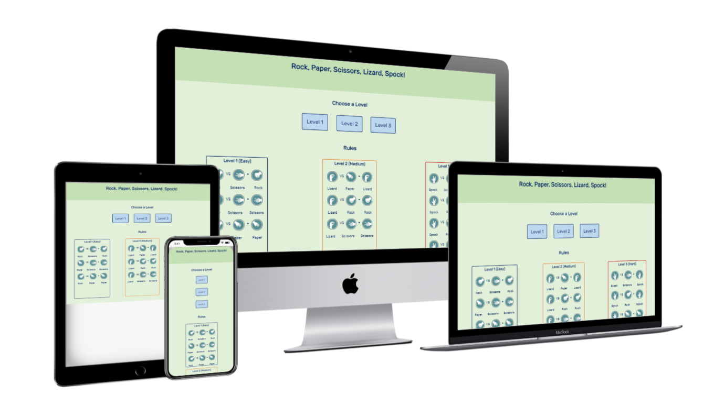

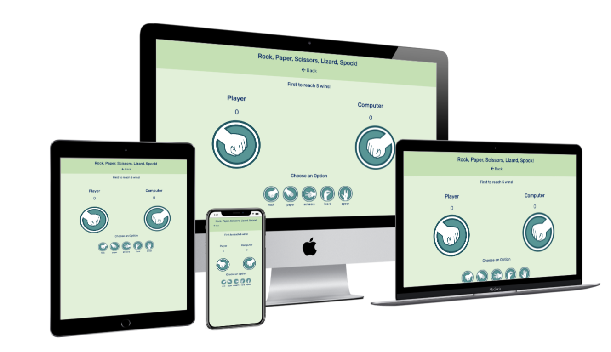

Screenshots taken from [techsini](http://techsini.com/multi-mockup/index.php).

*Larger-screen devices*

Because naturally most users read left to right, I positioned the level select buttons horizontally and the rules sections horizontaly. This was also done to avoid empty space as initially I had the rules underneath one another but still the same width of the borders.

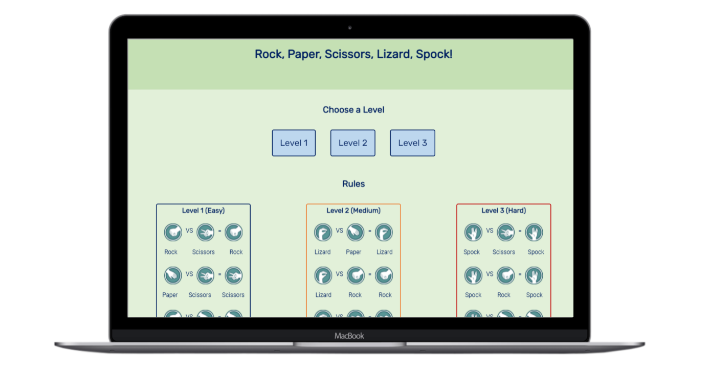

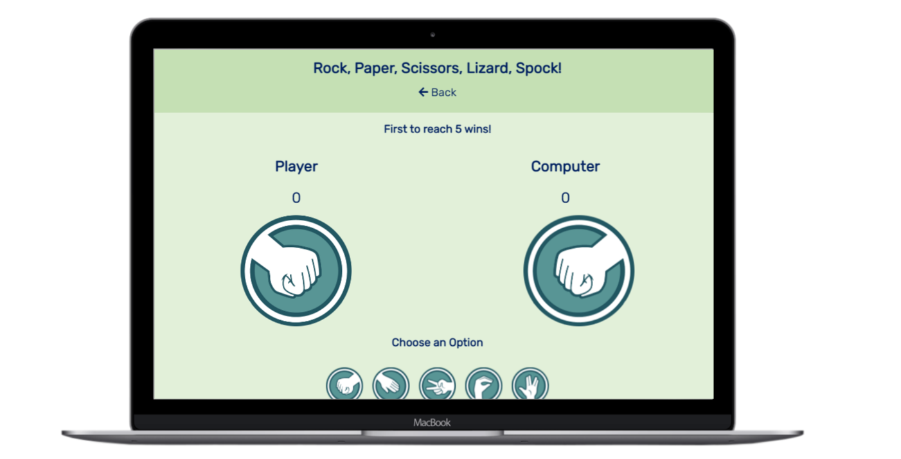

*Smaller-screen devices*

For smaller devices, the level select buttons shrink a little but remain clearly readable. The buttons change display to be underneath one another as does the rules section.

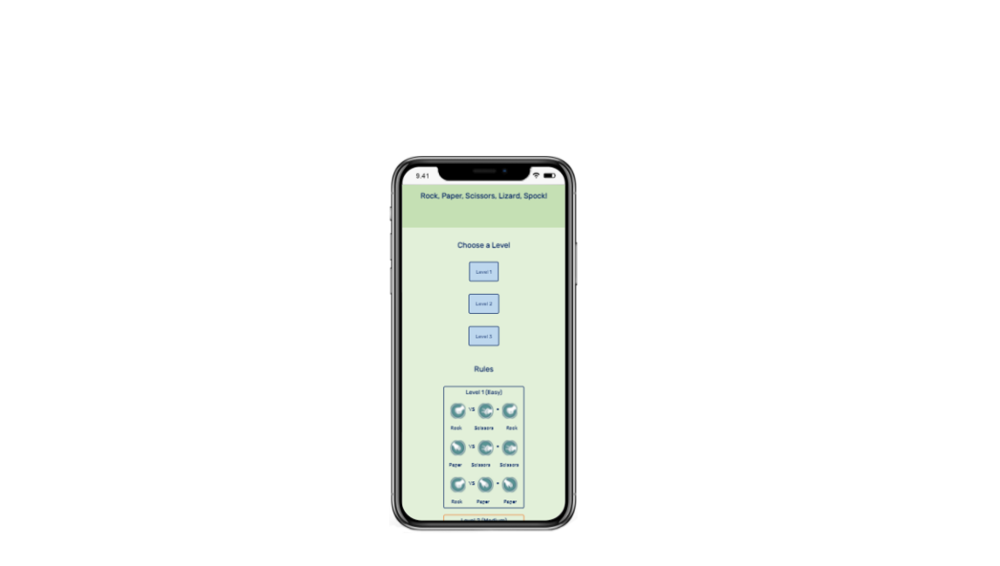

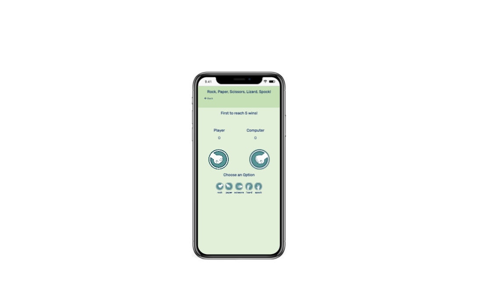

___
## Technology Used

*img bin*

The hand signs were downloaded from the site [img bin](https://imgbin.com/)

*Youtube*

I watched videos and walkthroughs via [Youtube]() that really helped and explained more about some of the functions I tried to write. Particularly the channels:

[Competent Programming](https://www.youtube.com/channel/UCZBwn0Sdl3mabNeDCIJmNlg/videos)

[Dev Ed](https://www.youtube.com/watch?v=qWPtKtYEsN4)

[Programming with Mosh](https://www.youtube.com/c/programmingwithmosh/videos)

## Deployment

This game has been successfully deployed on GitHub and a live link can be found here: https://mattm1346.github.io/Rock-Paper-Scissors/

The game was deployed using the following steps:

Login to GitHub and click on [My Repositories](https://github.com/mattm1346?tab=repositories)

Open Rock-Paper-Scissors

Go to [settings](https://mattm1346.github.io/Rock-Paper-Scissors/)

Scroll down and click on pages

Locate 'Source' and change the dropdown from 'None' to 'Master Branch'

The page should refresh and the link will be deployed.

*Forking*

To Fork the game follow these steps:

Login to GitHub and locate Rock-Paper-Scissors

Click on the 'Fork' icon (above settings)

It should create a copy of the original Rock-Paper-Scissors

## Credits

[Afiniti](https://www.afiniti.com/corporate/rock-paper-scissors) has a great design in terms of style. However, there is no option allowing the user to change the level of difficulty.

[rock-paper-scissors-game](https://www.rock-paper-scissors-game.com/) is simple but very effective. One drawback is that the game resets just after one round. It could be better if it had more rounds before resetting the game.

*Acknowledgements*

I really struggled with the JavaScript of this project. When building the code, some functions that I wrote and called still would not work. My mentor, Akshat was a huge help in restructuring my code and suggesting code.

For a few of the commits, labelled as 'update JavaScript' Akshat has written step by step and sent to me via Slack. I then copied the code and pasted into the JavaScript then commited and pushed so the deployed website would update and we could progress further with the remaining problems.

After the call, I then removed the code that was pasted in and went through step by step adding in the code and trying to understand what functions did what.

* [Code Institute](https://learn.codeinstitute.net/)

* [MDN Web Docs](https://developer.mozilla.org/en-US/)

* [img bin](https://imgbin.com/)

* [Font Awesome](https://fontawesome.com/)